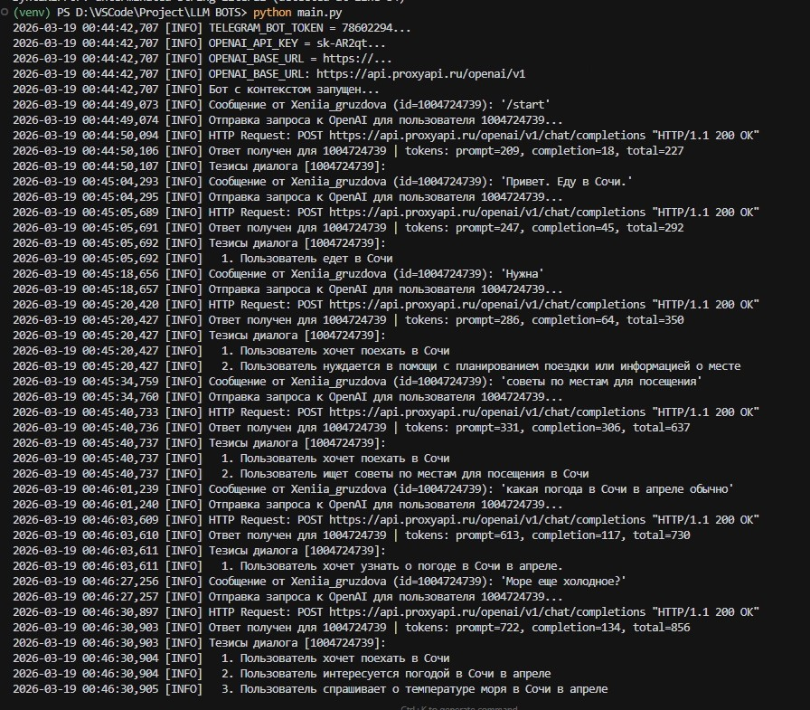
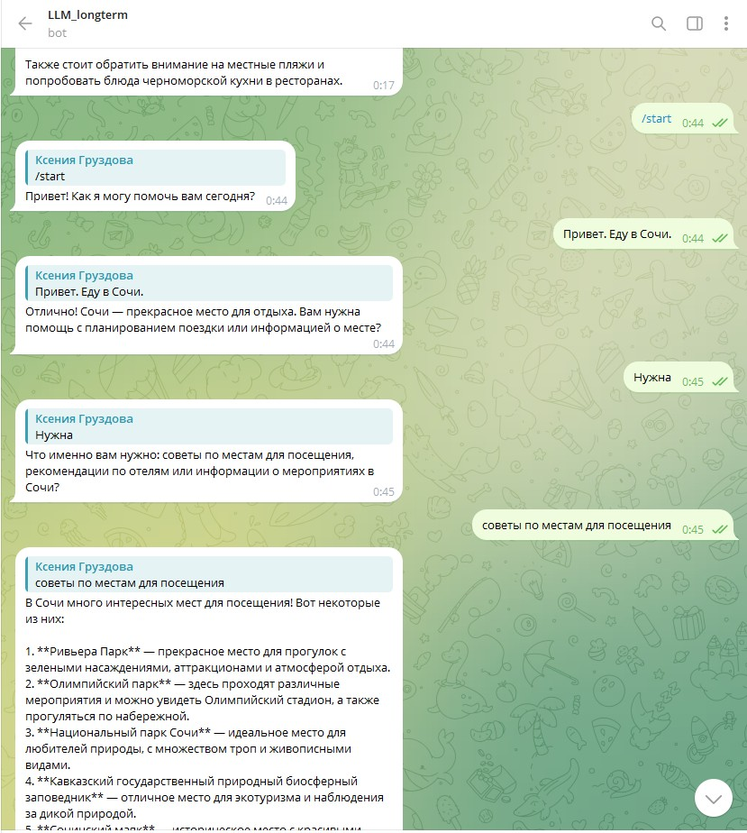
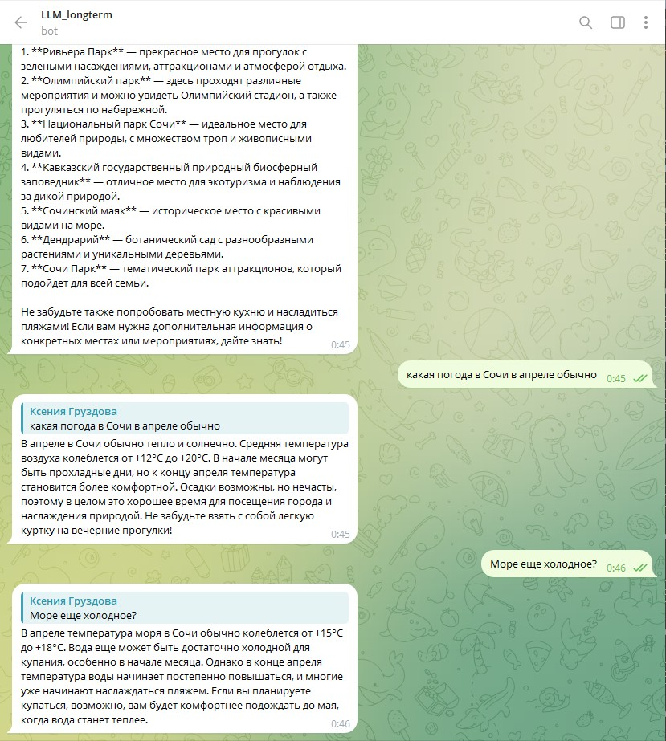
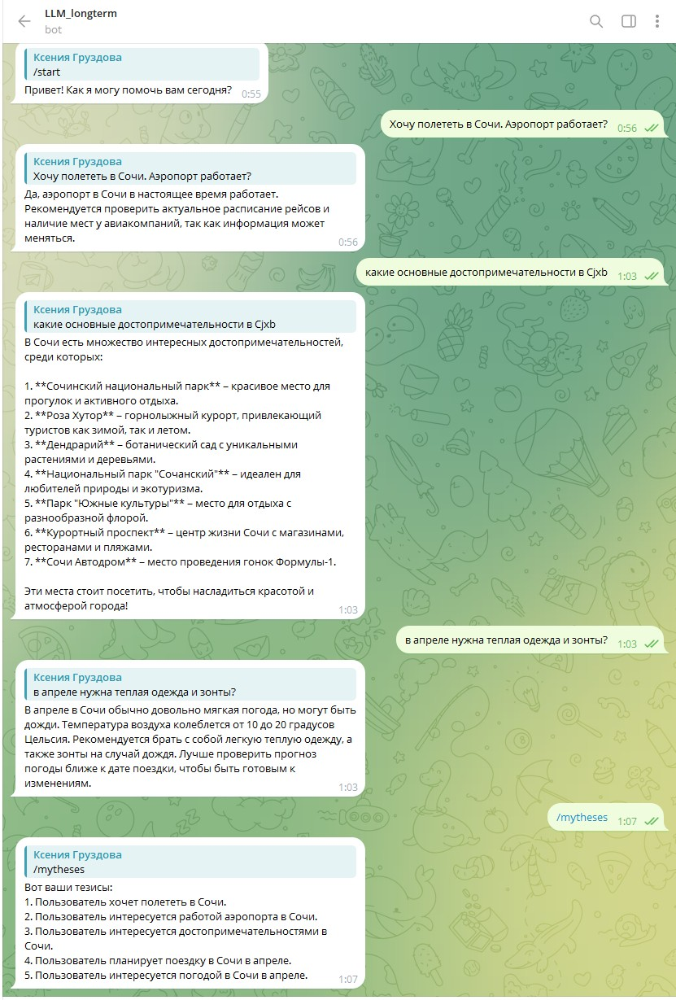
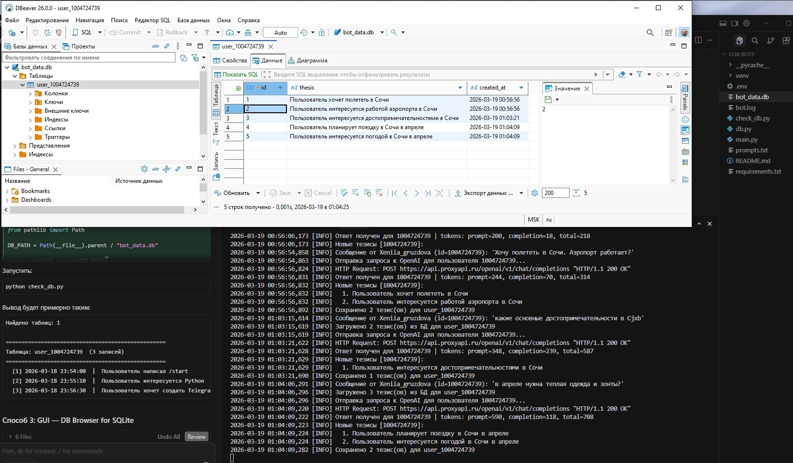
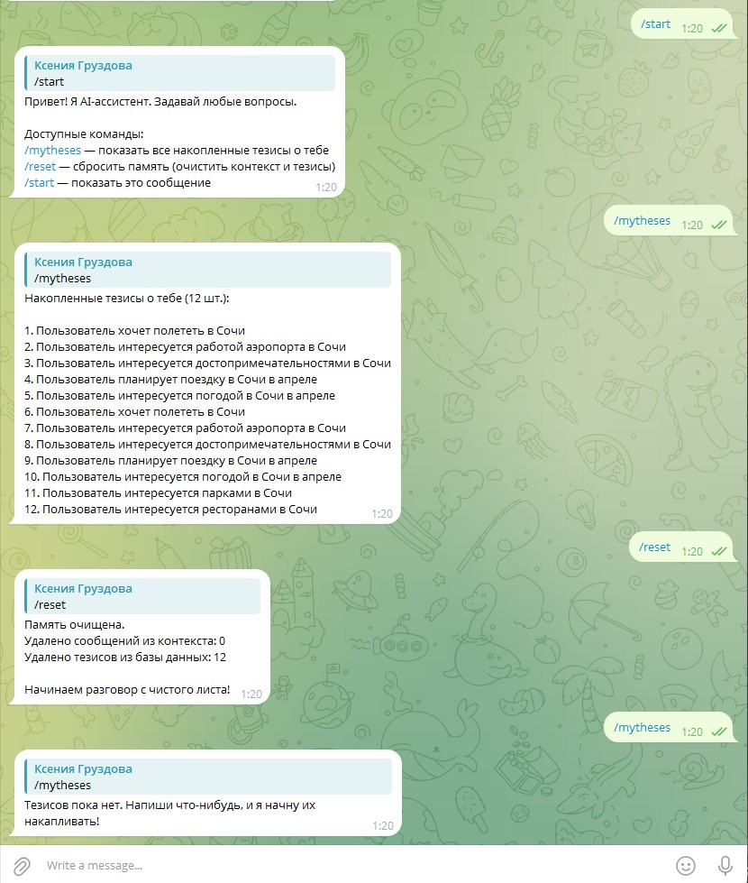
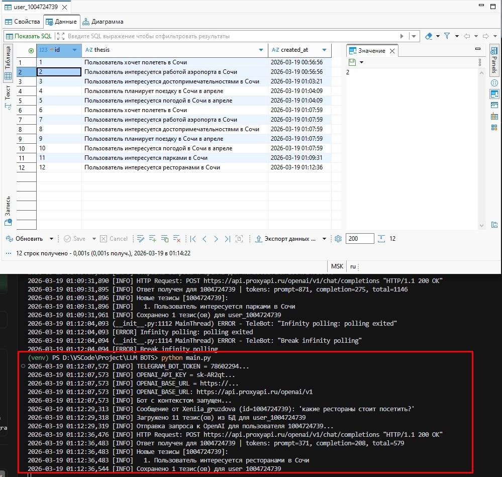

# LLM Telegram Bot

## Краткое описание

Telegram-бот с долгосрочной памятью на базе **GPT-4o-mini** (через прокси-сервис). Бот не просто отвечает на вопросы — он накапливает тезисы каждого диалога в базе данных SQLite и использует их при следующих разговорах, формируя персонализированный контекст. Ответы возвращаются в структурированном JSON-формате (Pydantic Structured Outputs): тезисы сохраняются в БД, пользователю отправляется только текст сообщения.

---

## Технологии

| Категория | Инструмент |
|---|---|
| Язык | Python 3.12 |
| Telegram | pyTelegramBotAPI 4.22.1 |
| LLM | OpenAI GPT-4o-mini (через прокси) |
| OpenAI SDK | openai 1.65.4 — `beta.chat.completions.parse` |
| Валидация схемы | Pydantic v2 (`BaseModel`) |
| База данных | SQLite3 (встроен в Python) |
| Конфигурация | python-dotenv 1.0.1 |
| Логирование | logging (консоль + файл `bot.log`) |

---

## Реализованный функционал

- Ответы на свободные вопросы пользователя через GPT-4o-mini
- **Структурированный вывод** — модель возвращает JSON с двумя полями: `theses` и `message`
- **Краткосрочная память** — последние 20 пар вопрос/ответ хранятся в оперативной памяти (deque)
- **Долгосрочная память** — тезисы каждого обмена сохраняются в SQLite; при следующем запросе загружаются и добавляются в системный промпт
- **Персональная таблица** для каждого пользователя (`user_<id>`) создаётся автоматически при первом сообщении
- **Команды управления памятью** — просмотр и полный сброс тезисов
- **Логирование** — все события пишутся в консоль и в файл `bot.log`
- **Проверка конфигурации** при старте — бот не запустится с незаполненным `.env`

---

## Структура проекта

```
LLM BOTS/
├── main.py          # Основная логика бота, обработчики команд
├── db.py            # Модуль работы с SQLite (тезисы пользователей)
├── check_db.py      # Утилита для просмотра содержимого БД
├── bot_data.db      # База данных SQLite (создаётся автоматически)
├── bot.log          # Лог-файл (создаётся автоматически)
├── .env             # Переменные окружения (не коммитить в git!)
├── requirements.txt # Зависимости проекта
└── README.md        # Документация
```

---

## Инструкция по запуску

### 1. Требования

- Python **3.12** (рекомендуется; 3.11+ допустимо)
- Аккаунт Telegram и бот, созданный через [@BotFather](https://t.me/BotFather)
- API-ключ прокси-сервиса (proxyapi.ru, vsegpt.ru, openrouter.ai и др.)

### 2. Установка

```powershell
# Создать виртуальное окружение на Python 3.12
py -3.12 -m venv venv
venv\Scripts\activate

# Установить зависимости
pip install -r requirements.txt
```

### 3. Настройка `.env`

```env
TELEGRAM_BOT_TOKEN=your_telegram_bot_token_here

# Выберите один из прокси-сервисов:
OPENAI_API_KEY=your_proxy_api_key_here
OPENAI_BASE_URL=https://api.proxyapi.ru/openai/v1
# OPENAI_BASE_URL=https://api.vsegpt.ru/v1
# OPENAI_BASE_URL=https://openrouter.ai/api/v1
```

### 4. Запуск

```powershell
python main.py
```

В консоли появится:
```
[INFO] TELEGRAM_BOT_TOKEN = 7860229...
[INFO] OPENAI_API_KEY = sk-AR2qt...
[INFO] OPENAI_BASE_URL = https://...
[INFO] Бот с контекстом запущен...
```

### 5. Проверка базы данных

```powershell
python check_db.py
```

---

## Доступы

| Ресурс | Ссылка / путь |
|---|---|
| Код проекта | `d:\Project\LLM BOTS\` |
| Telegram-бот | Найти по имени бота в Telegram |
| База данных | `bot_data.db` в папке проекта |
| Логи | `bot.log` в папке проекта |

---

## Команды бота

| Команда | Описание |
|---|---|
| `/start` | Приветствие, список доступных команд, инициализация таблицы в БД |
| `/mytheses` | Показать все накопленные тезисы о пользователе из базы данных |
| `/reset` | Полный сброс памяти: очищает историю диалога (RAM) и все тезисы (SQLite) |
| любое сообщение | Отправить вопрос ассистенту; бот ответит и сохранит тезисы в БД |

---

## Как работает память

```
Входящее сообщение
        │
        ▼
┌─────────────────────────────────────────────┐
│  Системный промпт = SYSTEM_PROMPT           │
│  + краткосрочный контекст (последние 20)    │
│  + тезисы из SQLite (долгосрочная память)   │
└─────────────────────────────────────────────┘
        │
        ▼
  GPT-4o-mini (Structured Output)
        │
        ▼
  JSON { theses: [...], message: "..." }
        │
        ├──► theses → сохраняются в SQLite (user_<id>)
        │             логируются в консоль
        │
        └──► message → отправляется пользователю в Telegram
```

> **Краткосрочная память** (deque, 20 пар) сбрасывается при перезапуске бота.
> **Долгосрочная память** (SQLite тезисы) сохраняется между перезапусками.

---

## Конфигурация модели

| Параметр | Значение | Описание |
|---|---|---|
| `model` | `gpt-4o-mini` | Используемая модель (поддерживает Structured Outputs) |
| `max_tokens` | `1500` | Максимальная длина ответа |
| `temperature` | `0.7` | Креативность ответов (0.0–1.0) |
| `maxlen` | `20` | Пар диалога в краткосрочной памяти |

---

## Зависимости

| Пакет | Версия | Назначение |
|---|---|---|
| `pyTelegramBotAPI` | 4.22.1 | Работа с Telegram Bot API |
| `openai` | 1.65.4 | Клиент OpenAI / прокси, Structured Outputs |
| `python-dotenv` | 1.0.1 | Загрузка переменных из `.env` |
| `pydantic` | 2.x | Валидация схемы JSON-ответа модели |

---

## Статус проекта

**В активной разработке.**

Реализовано:
- [x] Базовый диалог с GPT через прокси
- [x] Краткосрочная память (in-memory history)
- [x] Структурированный вывод (Pydantic + Structured Outputs)
- [x] Долгосрочная память (SQLite тезисы)
- [x] Команды `/start`, `/reset`, `/mytheses`
- [x] Логирование в файл и консоль

Планируется:
- [ ] Веб-интерфейс для просмотра тезисов всех пользователей
- [ ] Поддержка нескольких системных промптов / ролей
- [ ] Экспорт истории диалога в файл
- [ ] Деплой на сервер (systemd / Docker)

---

## Скриншоты

### Логи в терминале


### Приветствие бота (/start)


### Диалог с ботом


### Ответ ассистента


### Тезисы в базе данных (/mytheses)


### Сброс истории (/reset)


### При запуске бот загружает сохраненный ранее контекст и добавляет его в системный промпт

